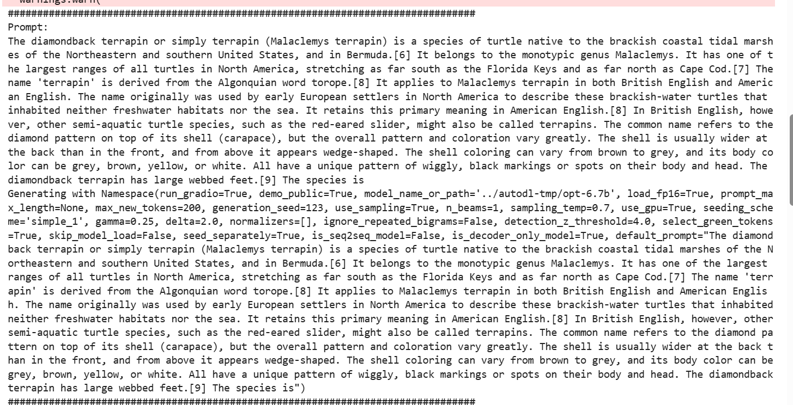
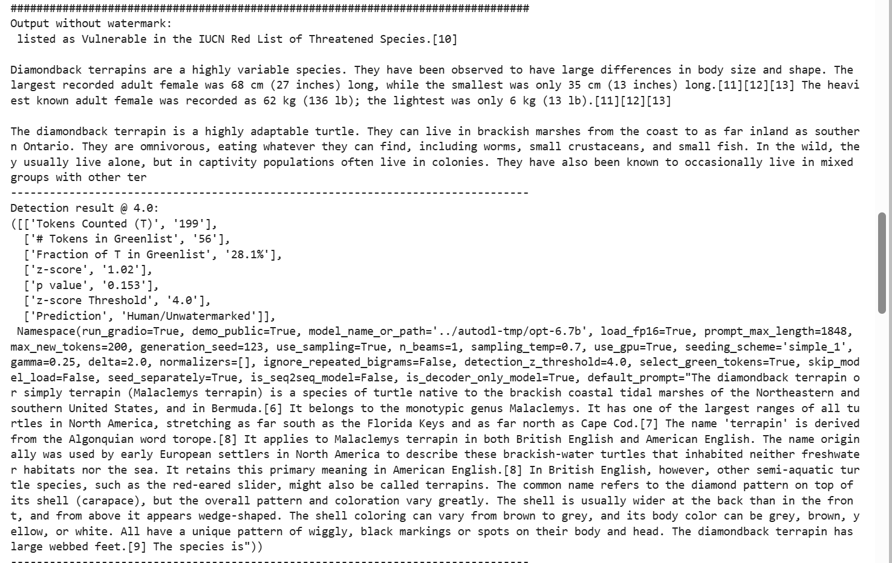
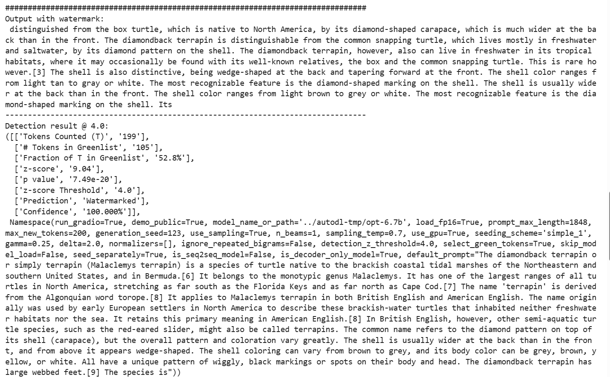

# 运行过程中遇到的问题

## 尝试运行demo_watermark

1. 

   - 问题：

     ```python
     requests.exceptions.SSLError: (MaxRetryError("HTTPSConnectionPool(host='huggingface.co', port=443): Max retries exceeded with url: /facebook/opt-6.7b/resolve/main/config.json
     ```

   - 解决办法：
     - 开始尝试了科学上网，成功，但后面发现文件比较大，需要在云服务器上面运行，便想在云服务器上面进行科学上网，设置代理，尝试了一段时间，没有成功，换办法
     - 后来，便尝试了，下载到本地，再上传至云服务器上面，解决

2.  

   - 问题：后面又遇到了一个特别大的文件，如果想要通过下载到本地，再上传，基本不可能
   - 解决办法：
     - 便上网看了很多教程，没有解决，最后有个教程说都跟官方网站提供的解决办法差不多，最后便想着去官方网站，碰碰运气，最后用huggingface-cli成功解决

3.  
   - 问题：后面便是遇到了环境中缺少各种不同的包
   - 解决办法：直接下载所缺失的包（很幸运没有包的版本冲突）
4.  
   - 问题：修改了运行文件的模型，但是还是一直报错
   - 解决办法：最后认真看，发现是调用的另一个文件没有修改
5.  
   - 问题：成功运行，但是出现了 `CUDA out of memory`的错误，当时租的机子是3090，显存20G
   - 解决办法：
     - 便换了4090，又可以跑了，但是跑了一会，又没有办法跑了
     - 然后就尝试其他办法，首先使用了float16精度，不行
     - 又尝试命令清除缓存，减少占用`torch.cuda.empty_cache()`，不行
     - 最后降低了batch_size,便能成功运行
6.  
   - 问题：后面代码出现问题，显示`concurrency_count`参数出现问题，上网查询后，表明其已经被弃用了
   - 解决方法：
     - 便把这个参数删除了，使用`concurrency_limit`

7.  

   - 问题：

     ```python
     RuntimeError: Expected all tensors to be on the same device, but found at least two devices, cpu and cuda:0! (when checking argument for argument index in method wrapper_CUDA__index_select)
     ```

   - 解决办法：

     - 最开始，一个一个把变量位置打出来，没有发现，哪里出错了
     - 后面有尝试，但都没有成功
     - 第二天，开机后，重新开始，结果没有问题了

8.  

   - 问题：再次出现`CUDA out of memory`的错误
   - 解决办法：
     - 先尝试了，修改了`limit_indices` ,不行
     - 后面又使用了小模型，不行
     - 便调整了生成参数，减少了max_new_tokens ，不行
     - 最后使用了更小的数据集，成功

9.  运行结果

   

   

   

## 运行run_watermarking

1.  

   - 问题（迭代器为空）

     ```python
     in main
         next(ds_iterator)
     StopIteration
     ```

   - 解决方法:
     - 因为最开始数据量太大，执行了`split="train[:10%]"` ，导致了格式错误
     - 后面最后，格式正确后，便解决了

2.  
   - 问题：`AssertionError: Expect no batch dimension currently!`
   - 解决办法：
     - 先把`batched=False`修改为`batched=True`,则换了个问题报错，最后要修改很多代码
     - 后来把小数据集换为原来的数据集，格式正确
     - 便没有出现问题了
3.  
   - 问题：`TypeError: 'type' object is not subscriptable`
   - 解决办法：
     - 因为python版本比较低，便更改语言格式从list[int]换为`List[int]`

4.  
   - 问题：`ValueError: BuilderConfig 'realnewslike' not found. Available: ['default']`
   - 解决方法：
     - 参数列表没有这个参数，将这个参数改为default

5.  
   - 问题：`RuntimeError: CUDA error: device-side assert triggered CUDA kernel errors might be asynchronously reported at some other API call, so the stacktrace below might be incorrect.`
   - 解决方法：
     - 这个问题尝试了很久，因为没有具体指出，错误在哪里，只有不停的打印输出代码，不停调试
     - 最后发现是文件夹不存在，便创建了一个文件夹，就得出结果了

6.  最终运行结果：

   

7.  

   - 问题：出现多个软件包，版本不兼容
   - 解决方法：根据报错，一个一个的去下载相兼容的包

8.  

   - 问题：

     ```python
      from types import NoneType
     ImportError: cannot import name 'NoneType' from 'types' 
     ```

   - 解决方法：python版本太低，语法受限，用`type(None)`代替`NoneType`

9. 最后的问题：

   

- 模型太大，无法连续下载，一直间隙断联，下载速度太慢
- 数据盘，内存不够，无法承载
- 然后，后面成功下载，一直没有办法成功读取

